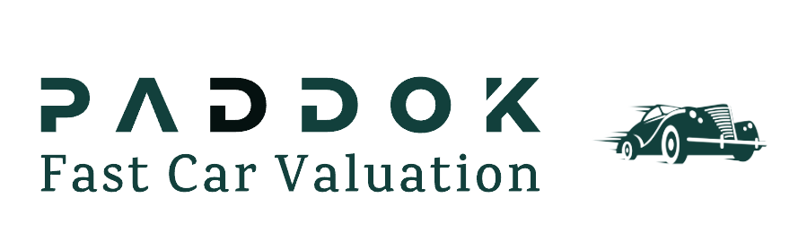

# Titulo

## Paddok

*TFM realizado por **Oscar Pörtner Ostos** y **Juan Cerezo Serrano** del Master IA y Bigdata del Malaga Tech Park*

### Logo (prototipo)

## 1. Justificación y descripción del proyecto.

### :black_nib: Justificación

El motivo de elegir este proyecto es el reto de obtener el precio de forma rápida para poder vender un coche o varios, puesto que creemos que las páginas de segunda mano no ayudan al vendedor con información precisa y de forma gráfica a que precio puede vender un particular o empresario su vehículo.

Nosotros queremos ayudar al particular o empresario a que con un simple vistazo pueda obtener con la mejor exactitud posible un precio al que poder vender su coche o coches, aportando información relevante y usando datos reales del mercado de coches de segunda mano de España.

### :book: Descripción

El proyecto consta de lo siguiente:

- Un modelo de predicción de precios de coches de segunda mano para el mercado Español, 
- Un chatbot que es capaz de orientar al usuario (particular o profesional) en los precios que hay en el mercado y sobre el coche o coches que quiera vender.
- Panel con estadísticas de mercado.

Con esto vamos a desarrollar, en un mismo panel, que el usuario pueda visualizar con estadísticas de manera rápida el estado del mercado de coches de segunda mano, usando filtros y con las implementaciones anteriormente mencionadas, para poder estimar cuál es el precio de venta más óptimo para vender su coche o coches.
