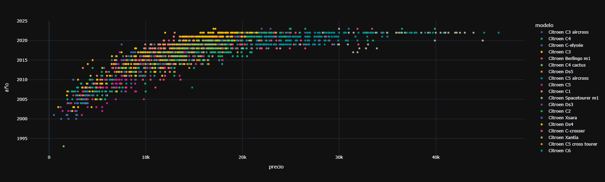

# Paddok

*TFM realizado por **Oscar Pörtner Ostos** y **Juan Cerezo Serrano** del Master IA y Bigdata del Malaga Tech Park*

### Logo (prototipo)

## 1. Justificación y descripción del proyecto.

### :black_nib: Justificación

El motivo de elegir este proyecto es el reto de obtener el precio de forma rápida para poder vender un coche o varios, puesto que creemos que las páginas de segunda mano no ayudan al vendedor con información precisa y de forma gráfica a que precio puede vender un particular o empresario su vehículo.

Nosotros queremos ayudar al particular o empresario a que con un simple vistazo pueda obtener con la mejor exactitud posible un precio al que poder vender su coche o coches, aportando información relevante y usando datos reales del mercado de coches de segunda mano de España.

### :book: Descripción

El proyecto consta de lo siguiente:

- Un modelo de predicción de precios de coches de segunda mano para el mercado Español. 
- Un chatbot que es capaz de orientar al usuario (particular o profesional) en los precios que hay en el mercado y sobre el coche o coches que quiera vender.
- Panel con estadísticas de mercado.

Con esto vamos a desarrollar, en un mismo panel, que el usuario pueda visualizar con estadísticas de manera rápida el estado del mercado de coches de segunda mano, usando filtros y con las implementaciones anteriormente mencionadas, para poder estimar cuál es el precio de venta más óptimo para vender su coche o coches.

### :computer: Tecnologías usadas:

:snake: Desarrollo

:chart: Analisis

:brain: Machine Learning

:spider: Scraping

## 2. Obtención de los datos

Puedes ver el desarrollo en el siguiente enlace:

La obtenición de los datos se ha realizado mediante Scraping de X página de coches donde hemos conseguido sacar unos 179000 coches de diferentes marcas y modelos con sus caracteristicas.

El proceso consistio en tener mas de una araña haciendo el scraping a diferentes marcas lo que ayuda a agilizar el proceso del scraping y tambien para controlar las perdidas de información.

Luego se guardaron los resultados en varios csv y se terminaron uniendo dichos csv hasta tener el csv final con el que se entrenaría poco despues el modelo.

## 3. Limpieza de datos (Preprocesado)

Puedes ver el desarrollo en el siguiente enlace:

En este apartado lo que hemos realizado lo siguiente:

1. Busqueda de nulos
2. Visualización de correlaciones
3. Eliminación de columnas que no son relevantes
4. Añadir columnas con las ids para las marcas, modelos, combustible y caja de cambios.
5. Creacción de diccionarios para poder trabajar mas comodamente en el desarrollo del frontend

#### 1. **Busqueda de nulos**

Para buscar los nulos he usado el comando `cars.isnull().sum()` donde he obtenido el siguiente resultado:

Como se puede ver, gracias a una buena adquisición de los datos no tenemos ningún nulo.

#### 2. **Visualización de correlaciones**

Ahora vamos a explicar un poco las correlaciones.

En este caso el foco prinpipal lo vamos a poner en la parte del precio, puesto que es la variable target y queremos ver que otras variables pueden afectarle en menor o mayor medida a la hora de predecir un precio.

En la siguiente imagen se muestran las correlaciones generales

y en la siguiente imagen se muestran las correlaciones sobre los precios

Por último visualizo las correlaciones entre el precio, los kilometros y el año, puesto que estas suelen ser las variables que se suelen buscar mas a la hora de comprar un coche de segunda mano.

#### 3. **Eliminación de columnas que no son relevantes**

Las columnas que voy a eliminar y que no considero relevantes viendo las correlaciones son las siguientes:

Algunas las quito por lógica y otras por que veo en las correlaciones que no influiran en el precio.

`'Unnamed: 0', 'puertas', 'maletero', 'longitud', 'altura', 'anchura', 'peso max', 'vel. maxima', 'c. mixto', 'c. urbano', 'extraurbano', 'cilindros', 'par maximo', 'color', 'garantía', 'vendedor', 'transmisión', 'carroceria', 'traccion'`

A este DataFrame sin las antiguas columnas lo voy a llamar `cars_pre`

#### 4. **Añadir columnas con las ids para las marcas, modelos, combustible, caja de cambios y localidad**

#### 5. **Creacción de diccionarios para poder trabajar mas comodamente en el desarrollo del frontend**

Por último genero los siguientes diccionarios para poder trabajar comodamente con los datos en Flutter

Y exporto en nuevo DataFrame a drive para poder tratarlo en las visualizaciones y en el machine learning

## 4. Exploración y visualización de los datos

Puedes ver el desarrollo en el siguiente enlace

En este apartado hemos realizado lo siguiente:

1. Visualización de los datos por cantidad de coches por localidad y modelo en general
2. Visualización de los datos de las marcas con mas de 10.000 coches:
    - Por cantidad mayor de 10.000 coches
    - Por cantidad mayor de 10.000 coches mas limitación de precio a 80.000€ y y kilometros a 500.000Km
        - Visualización por precio/año
        - Visualización por kilometro/año
3. Visualización de los datos de las marcas con menos de 10.000 coches:
    - Por cantidad menor de 10.000 coches mas limitación de precio a 80.000€ y y kilometros a 500.000Km
        - Visualización por precio/año
        - Visualización por kilometro/año
4. Conclusiones

### 1. **Visualización de los datos por cantidad de coches por localidad y modelo en general**

Otra forma de mostrarlo sería con barras:

### 2. **Visualización de los datos de las marcas con mas de 10.000 coches**

Lo primero que mostramos aquí son las marcas donde hay mas de 10000 coches

En la siguiente gráfica se puede ver un ejemplo de la cantidad de modelos en relación año/precio sin limitar el precio, como veremos mas adelante.

La gráfica anterior la genere con el siguiente bucle `for`, para poder mostrar la cantidad de modelos por marca para las marcas que estamos analizando.

Cosas interesante que descubrimos aquí son distintos outlayers, en este caso en relación al precio, lo que me hace pensar que si limito el precio a una cantidad mas baja puedo quitarme este tipo de outlayers, aunque también tengo en contra que elimino coches de gama alta, lo que también nos hace plantearnos que en principio nos centremos en el mercado de media-alta gama.

Aquí la visualización que nos hace plantearnos el filtro:

Outlayer detectado

Con el outlayer:

Sin el outlayer:

Ahora bien, la limitación de kilometros la hago por que al revisar el `describe` que el máximo de kilometros es casi 3.000.000Km, por lo que creo que me puede distorsionar los datos en la parte del machine learning, pero antes de realizarlo veo a ver cuantos coches pueden ser afectados con el siguiente código:

Como se puede ver solo están afectados 34 coches, por lo que decido limitar el kilometraje a 500.000km.

Ahora voy a realizar algo similar pero con las marcas que contienen menos de 10 coches

Primero saco la cantidad de coches que se verian afectados:

Y ahora lo muestro graficamente

Viendo que la cantidad de coches afectada no es muy grande decido quitar estas marcas en la parte de preparación de los datos para machine learning que veremos mas adelante

**Limitación de precio a 80.000€ y y kilometros a 500.000Km**

Una vez limitados los datos del DataFrame los resultados son los siguientes:

Limitación por precio.

Limitación por kilometros.

Como se puede ver los datos que mas uniformes, por que en los siguientes pasos voy aplicar lo mismo pero para el resto de coches.

### 3. **Visualización de los datos de las marcas con menos de 10.000 coches**

Empezamos mostrando la cantidad de marcas y de modelos que tenemos en el resto de coches.

A continuación muestro 2 gráficas para marcas inferiores a 10000 coches y con la limitación de precio y kilometros ya establecida.

Gráfica con limitación de precio

Gráfica con limitación de kilometros

Ya para cerrar el apartado de la visualización voy a exponer 2 gráficas que he includo en el colab:

La primera incluye un slider que permite seleccionar el año, esto es util para mostrar la cantidad de coches por año de todas las marcas

Otra gráfica que muestro es la correlación del precio respecto al motor(KW), ya que en las correlaciones salian bastante relacionadas

### Clonclusión de la visualización

Debo de limitar el $\color{orange}{precio}$ a $\color{orange}{80.000€}$, los $\color{orange}{kilometros}$ a $\color{orange}{500.000km}$ y $\color{red}{quitar}$ las $\color{orange}{marcas}$ con cantidad de $\color{orange}{coches~inferior~a~10}$.

## 5. Preparación de los datos para Machine Learning

Puedes ver el desarrollo en el siguiente enlace:

En este apartado vamos a realizar lo siguiente:

1. Pasar las columnas a nombres en ingles, esto es importante puesto que letras como la `ñ` pueden provocar errores en los algoritmos de TensorFlow.

2. Eliminar columnas no relevantes, revisando con las correlaciones, por ejemplo, para pasarlos a los algoritmos de TensorFlow debo de eliminar las columnas numericas de las ids, para que no haya datos redundantes.

3. Preparar el datasets de diferentes maneras para pasarselo a los algoritmos de ML.

Esta preparación se va a hacer concretamente para 3 algoritmos (2 de TensorFlow y 1 de Sklearn), y hay que prepararlos de diferente forma, ya que para TensorFlow podemos pasarle valores categorios y numericos, pero para Sklean solo podemos pasar numerios.

Dicho lo anterior voy a preparar el dataset que creamos en el punto 3 ***Limpieza de datos (Preprocesado)*** tanto para TensorFlow como para Sklearn.

Los datasets a preparar son los siguientes:

- Dataset completo
- Dataset limitando el precio y los kilometros
- Dataset limitando el precio, los kilometros y las marcas con coches con cantidad inferior a 10
- Dataset limitando el precio, los kilometros, las marcas con coches con cantidad inferior a 10 y dejando solo mas columas de `mark`, `model`, `year`, `horses`, `km`, `fuel`, `gearbox`, `price`, `displacement_engine`, `marches`

Gracias a que pase variables categoricas a numéricas, como, marca, modelo, cambio, combustiable, a la hora de tratar los datasets para Sklearn será mas rápido.