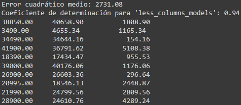
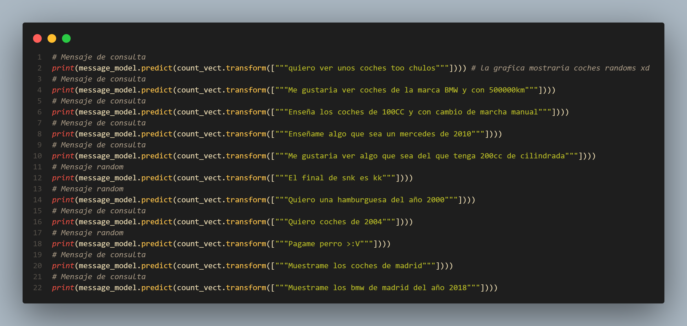
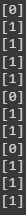

*TFM realizado por **Oscar Pörtner Ostos** y **Juan Cerezo Serrano** del Master IA y Bigdata del Malaga Tech Park*

Puedes acceder a la aplicación y la presentación de la misma desde los siguientes enlaces:

[Paddock](https://padook-5be51.web.app/#/) | [Presentación](#8-aplicación-web)

## Índice

* [Justificación y descripción del proyecto](#id1)
* [Obtención de los datos](#id2)
* [Limpieza de datos (Preprocesado)](#id3)
* [Exploración y visualización de los datos](#id4)
* [Preparación de los datos para Machine Learning](#id5)
    * [TensorFlow](#id6)
    * [Sklearn](#id7)
* [Entrenamiento del modelo y comprobación del rendimiento](#id8)
    * [TensorFlow](#id9)
    * [Sklearn](#id10)
* [NPL ChatBOT Einstein](#id11)
* [Desarrollo Web](#id12)
    * [Prototipo](#id13)
    * [Capturas de la aplicación](#id14)
    * [Video explicativo](#id15)
* [Conclusiones](#id16)

## 1. Justificación y descripción del proyecto.

### :black_nib: Justificación

El motivo de elegir este proyecto es el reto de obtener el precio de forma rápida para poder vender un coche o varios, puesto que creemos que las páginas de segunda mano no ayudan al vendedor con información precisa y de forma gráfica a que precio puede vender un particular o empresario su vehículo.

Nosotros queremos ayudar al particular o empresario a que con un simple vistazo pueda obtener con la mejor exactitud posible un precio al que poder vender su coche o coches, aportando información relevante y usando datos reales del mercado de coches de segunda mano de España.

### :book: Descripción

El proyecto consta de lo siguiente:

- Un modelo de predicción de precios de coches de segunda mano para el mercado Español. 
- Un chatbot que es capaz de orientar al usuario (particular o profesional) en los precios que hay en el mercado y sobre el coche o coches que quiera vender.
- Panel con estadísticas de mercado.

Con esto vamos a desarrollar, en un mismo panel, que el usuario pueda visualizar con estadísticas de manera rápida el estado del mercado de coches de segunda mano, usando filtros y con las implementaciones anteriormente mencionadas, para poder estimar cuál es el precio de venta más óptimo para vender su coche o coches.

:computer: Tecnologías usadas
---

### :snake: Desarrollo

Lenguajes

Entornos

FrontEnd

BackEnd
 

Diseño

Control de versiones 

### :chart: Analisis

### :brain: Machine Learning

### :spider: Scraping

## 2. Obtención de los datos.

Puedes ver el desarrollo en el siguiente enlace:

La obtenición de los datos se ha realizado mediante Scraping de X página de coches donde hemos conseguido sacar unos 179000 coches de diferentes marcas y modelos con sus caracteristicas.

El proceso consistio en tener mas de una araña haciendo el scraping a diferentes marcas lo que ayuda a agilizar el proceso del scraping y tambien para controlar las perdidas de información.

Luego se guardaron los resultados en varios csv y se terminaron uniendo dichos csv hasta tener el csv final con el que se entrenaría poco despues el modelo.

A continuación se expone parte del código utilizado para realizar el scrapin:

#### 1. **Declaración de variables**

Declararemos las siguientes variables:

* URL: Guardaremos el link de la pagina que vamos a extraer
* header: Las cabeceras necesarias para que nuestra araña pueda scrapear sin problemas la web
* marcas: Aqui tendremos las marcas de coches que iremos extrayendo
* provincias: Tambien necesitaremos filtrar por provincias y asi tener resultados mas precisos.

#### 2. **Creación del dataframe**

Aqui crearemos la estructura de datos para nuestros datos que luego pasarán a ser analizados.

#### 3. **Scraping**

En el siguiente bloque de código lo que se realiza sobre un bucle for el scraping en si, cada coche extraido se mete en una lista y esta a continuación se añade al dataframe que creamos en la imagen anterior.

### **Randomizar los datos**

Será necesario randomizar los datos para que en el entrenamiento se consiga un mejor resultado debido a que tendrá diferentes tipos de datos, para ello se hace lo siguiente:

Por último guardamos el dataframe en un csv

## 3. Limpieza de datos (Preprocesado).

Puedes ver el desarrollo en el siguiente enlace:

En este apartado lo que hemos realizado lo siguiente:

1. Busqueda de nulos
2. Visualización de correlaciones
3. Eliminación de columnas que no son relevantes
4. Añadir columnas con las ids para las marcas, modelos, combustible y caja de cambios.
5. Creacción de diccionarios para poder trabajar mas comodamente en el desarrollo del frontend

#### 1. **Busqueda de nulos**

Para buscar los nulos he usado el comando `cars.isnull().sum()` donde he obtenido el siguiente resultado:

Como se puede ver, gracias a una buena adquisición de los datos no tenemos ningún nulo.

#### 2. **Visualización de correlaciones**

Ahora vamos a explicar un poco las correlaciones.

En este caso el foco prinpipal lo vamos a poner en la parte del precio, puesto que es la variable target y queremos ver que otras variables pueden afectarle en menor o mayor medida a la hora de predecir un precio.

En la siguiente imagen se muestran las correlaciones generales

y en la siguiente imagen se muestran las correlaciones sobre los precios

Por último visualizamos las correlaciones entre el precio, los kilometros y el año, puesto que estas suelen ser las variables que se suelen buscar mas a la hora de comprar un coche de segunda mano.

#### 3. **Eliminación de columnas que no son relevantes**

Las columnas que vamos a eliminar y que no consideramos relevantes viendo las correlaciones son las siguientes:

Algunas las quitamos por lógica y otras por que vemos en las correlaciones que no influiran en el precio.

`'Unnamed: 0', 'puertas', 'maletero', 'longitud', 'altura', 'anchura', 'peso max', 'vel. maxima', 'c. mixto', 'c. urbano', 'extraurbano', 'cilindros', 'par maximo', 'color', 'garantía', 'vendedor', 'transmisión', 'carroceria', 'traccion'`

A este DataFrame sin las antiguas columnas lo vamos a llamar `cars_pre`

#### 4. **Añadir columnas con las ids para las marcas, modelos, combustible, caja de cambios y localidad**

#### 5. **Creacción de diccionarios para poder trabajar mas comodamente en el desarrollo del frontend**

Por último generamos los siguientes diccionarios para poder trabajar comodamente con los datos en Flutter

Y exportamos en nuevo DataFrame a drive para poder tratarlo en las visualizaciones y en el machine learning

## 4. Exploración y visualización de los datos.

Puedes ver el desarrollo en el siguiente enlace

En este apartado hemos realizado lo siguiente:

1. Visualización de los datos por cantidad de coches por localidad y modelo en general
2. Visualización de los datos de las marcas con mas de 10.000 coches:
    - Por cantidad mayor de 10.000 coches
    - Por cantidad mayor de 10.000 coches mas limitación de precio a 80.000€ y y kilometros a 500.000Km
        - Visualización por precio/año
        - Visualización por kilometro/año
3. Visualización de los datos de las marcas con menos de 10.000 coches:
    - Por cantidad menor de 10.000 coches mas limitación de precio a 80.000€ y y kilometros a 500.000Km
        - Visualización por precio/año
        - Visualización por kilometro/año
4. Conclusiones

### 1. **Visualización de los datos por cantidad de coches por localidad y modelo en general**

Otra forma de mostrarlo sería con barras:

### 2. **Visualización de los datos de las marcas con mas de 10.000 coches**

Lo primero que mostramos aquí son las marcas donde hay mas de 10000 coches

En la siguiente gráfica se puede ver un ejemplo de la cantidad de modelos en relación año/precio sin limitar el precio, como veremos mas adelante.

La gráfica anterior la genere con el siguiente bucle `for`, para poder mostrar la cantidad de modelos por marca para las marcas que estamos analizando.

Cosas interesante que descubrimos aquí son distintos outliers, en este caso en relación al precio, lo que me hace pensar que si limito el precio a una cantidad mas baja puedo quitarme este tipo de outliers, aunque también tengo en contra que elimino coches de gama alta, lo que también nos hace plantearnos que en principio nos centremos en el mercado de media-alta gama.

Aquí la visualización que nos hace plantearnos el filtro:

Outlier detectado

Con el outlier:

Sin el outlier:

Ahora bien, la limitación de kilometros la hacemos por que al revisar el `describe` que el máximo de kilometros es casi 3.000.000Km, por lo que creemos que me puede distorsionar los datos en la parte del machine learning, pero antes de realizarlo veo a ver cuantos coches pueden ser afectados con el siguiente código:

Como se puede ver solo están afectados 34 coches, por lo que decido limitar el kilometraje a 500.000km.

Ahora voy a realizar algo similar pero con las marcas que contienen menos de 10 coches

Primero saco la cantidad de coches que se verian afectados:

Y ahora lo muestro graficamente

Viendo que la cantidad de coches afectada no es muy grande decidimos quitar estas marcas en la parte de preparación de los datos para machine learning que veremos mas adelante

**Limitación de precio a 80.000€ y y kilometros a 500.000Km**

Una vez limitados los datos del DataFrame los resultados son los siguientes:

Limitación por precio.

Limitación por kilometros.

Como se puede ver los datos que mas uniformes, por que en los siguientes pasos vamos a aplicar lo mismo pero para el resto de coches.

### 3. **Visualización de los datos de las marcas con menos de 10.000 coches**

Empezamos mostrando la cantidad de marcas y de modelos que tenemos en el resto de coches.

A continuación mostramos 2 gráficas para marcas inferiores a 10000 coches y con la limitación de precio y kilometros ya establecida.

Gráfica con limitación de precio

Gráfica con limitación de kilometros

Ya para cerrar el apartado de la visualización vamos a exponer 2 gráficas que he includo en el colab:

La primera incluye un slider que permite seleccionar el año, esto es util para mostrar la cantidad de coches por año de todas las marcas

Otra gráfica que mostramos es la correlación del precio respecto al motor(KW), ya que en las correlaciones salian bastante relacionadas

### 4. **Clonclusión de la visualización**

Debemos de limitar el precio a 80.000€, los kilometros a 500.000km y quitar las marcas con cantidad de coches inferior a 10.

## 5. Preparación de los datos para Machine Learning.

Puedes ver el desarrollo en el siguiente enlace:

En este apartado vamos a realizar lo siguiente:

1. Pasar las columnas a nombres en ingles, esto es importante puesto que letras como la `ñ` pueden provocar errores en los algoritmos de TensorFlow.

2. Eliminar columnas no relevantes, revisando con las correlaciones, por ejemplo, para pasarlos a los algoritmos de TensorFlow debo de eliminar las columnas numericas de las ids, para que no haya datos redundantes.

3. Preparar el datasets de diferentes maneras para pasarselo a los algoritmos de ML.

Esta preparación se va a hacer concretamente para 3 algoritmos (2 de TensorFlow y 1 de Sklearn), y hay que prepararlos de diferente forma, ya que para TensorFlow podemos pasarle valores categorios y numericos, pero para Sklean solo podemos pasar numerios.

Dicho lo anterior vamos a preparar el dataset que creamos en el punto 3 ***Limpieza de datos (Preprocesado)*** tanto para TensorFlow como para Sklearn.

Los datasets a preparar son los siguientes:

- Dataset completo
- Dataset limitando el precio y los kilometros
- Dataset limitando el precio, los kilometros y las marcas con coches con cantidad inferior a 10
- Dataset limitando el precio, los kilometros, las marcas con coches con cantidad inferior a 10 y dejando solo mas columas de `mark`, `model`, `year`, `horses`, `km`, `fuel`, `gearbox`, `price`, `displacement_engine`, `marches`
- Dataset donde se realiza lo anterior mas la eliminación de modelos que tienen una cantidad de coches inferior a 5.

Gracias a que se pasaron las variables categoricas a numéricas, como, marca, modelo, cambio, combustiable, a la hora de tratar los datasets para Sklearn será mas rápido.

Para realizar todos los puntos anteriores establecemos la siguiente clase:

A continuación creamos un diccionario el cual alberca por separado los DataFrames para trabajarlos con mas rapidez en los algoritmos de ML:

Dando para cada DataFrame los siguientes resultados:

***TensorFlow***
---

Para `dict_dataframes['tensorflow']['complete']`

Para `dict_dataframes['tensorflow']['limit']`

Para `dict_dataframes['tensorflow']['less_limit']`

Para `dict_dataframes['tensorflow']['less_columns']`

Para `dict_dataframes['tensorflow']['less_columns_models']`

***Sklearn***
---

Para `dict_dataframes['sklearn']['complete']`

Para `dict_dataframes['sklearn']['limit']`

Para `dict_dataframes['sklearn']['less_limit']`

Para `dict_dataframes['sklearn']['less_columns']`

Para `dict_dataframes['sklearn']['less_columns_models']`

También creamos visualizaciones de correlaciones, estas se pueden ver en el colab enlazado al principio de este punto.

## 6. Entrenamiento del modelo y comprobación del rendimiento

Puedes ver el desarrollo en el siguiente enlace:

En este punto lo mas importante es saber que algoritmo de machine learning se va a utilizar, en nuestro caso vamos a trabajar con arboles de decisión en vez de regresiones lineales.

**¿Por que arboles de decisión?**

Para responder a esta pregunta vamos a exponer los 3 puntos que nos han hecho tomar esta decisión:

1. Interpretación: los árboles de decisión son fáciles de interpretar, ya que se puede seguir el árbol y entender las decisiones que se están tomando en cada nodo. Las regresiones lineales, por otro lado, pueden ser más difíciles de interpretar ya que se trata de una relación matemática compleja.

2. Flexibilidad: los árboles de decisión son modelos no paramétricos, lo que significa que no hacen supuestos sobre la forma de la relación entre las variables de entrada y la variable de salida. Por lo tanto, pueden ser más flexibles y capaces de capturar patrones complejos en los datos. Las regresiones lineales, por otro lado, asumen una relación lineal y pueden ser menos flexibles en su capacidad para capturar patrones complejos.

3. Manejo de variables categóricas: los árboles de decisión pueden manejar fácilmente variables categóricas, ya que las decisiones se toman en función de las categorías de las variables de entrada. Las regresiones lineales pueden requerir técnicas adicionales, como la codificación one-hot, para manejar variables categóricas.

Una vez dicho esto y como se vio en el punto 5, vamos a trabajar con 3 algoritmos en concreto, que son los siguientes:

[*`GradientBoostedTreesModel`*](https://www.tensorflow.org/decision_forests/api_docs/python/tfdf/keras/GradientBoostedTreesModel) de **TensorFlow**

[*`RandomForestModel`*](https://www.tensorflow.org/decision_forests/api_docs/python/tfdf/keras/RandomForestModel) de **TensorFlow**

[*`RandomForestRegressor`*](https://scikit-learn.org/stable/modules/generated/sklearn.ensemble.RandomForestRegressor.html) de **Sklearn**

Una vez expuesto esto pasamos a detallar el código utilizado, el rendimiento obtenido y las predicciones para todos los DataFrames que creamos en el punto 5.

**TensorFlow**
---

### Código utilizado para **GradientBoostedTreesModel** y **RandomForestModel**

Empezamos creando una clase para poder llamar comodamente a los algoritmos

En la imagen anterior se puede ver como están configurados los algoritmos para trabajar con regresión donde cada parametro significa lo siguiente:

En **GradientBoostedTreesModel**:

`task=tfdf.keras.Task.REGRESSION`: indica que el modelo de árbol aleatorio se utilizará para un problema de regresión.

`validation_ratio=0.1`: el 10% de los datos de entrenamiento se utilizarán para la validación durante el ajuste del modelo.

`num_trees=100`: el número de árboles en el bosque aleatorio será de 100.

`max_depth=10`: establece la profundidad máxima de cada árbol del bosque en 10.

`l1_regularization=0.01`: la regularización L1 (Lasso) se aplicará al modelo con una fuerza de 0.01. Esta regularización ayuda a evitar el sobreajuste y mejora la generalización del modelo.

`l2_regularization=0.01`: la regularización L2 (Ridge) se aplicará al modelo con una fuerza de 0.01. Esta regularización también ayuda a evitar el sobreajuste y mejora la generalización del modelo.

`early_stopping='LOSS_INCREASE'`: el entrenamiento del modelo se detendrá si el error de validación aumenta durante varias iteraciones consecutivas.

`loss="SQUARED_ERROR"`: se utilizará la función de pérdida de error cuadrático medio (MSE) para medir la discrepancia entre las predicciones del modelo y los valores reales.

En **RandomForestModel**:

`split_axis="AXIS_ALIGNED"`: indica que se utilizará el algoritmo de división de nodos "AXIS_ALIGNED", que divide los datos a lo largo de un eje específico para cada característica.

`categorical_algorithm="CART"`: indica que se utilizará el algoritmo "CART" para manejar variables categóricas. CART es un algoritmo que se utiliza para construir árboles de decisión que manejan tanto variables numéricas como categóricas.

El siguiente código lo que realiza es una preparación y entrenamiento de todos los dataframes, guardando los modelos el google drive y en `dict_tr_ts` los datos de test para poder hacer predicciones despues.

Una vez realizado esto lo que hacemos es cargar los modelos desde Google drive, esto me permite que cada vez que quiera hacer una predicción no tener que entrenar los modelos.

Para los modelos de `GradientBoostedTreesModel`:

Para los modelos de `RandomForestRegressor`:

Una vez hecho esto, lo que se realiza es la creación de 2 funciones, una para la representación gráfica del rendimiento de los modelos con las predicciones y otra donde se prueban las predicciones y se muestran dichas gráficas.

**Función para la generación de gráficas**

**Función para probar predicciones y pintar las gráficas**

En esta función se puede ver el uso de MSE y R2_score que hacen lo siguiente:

El ***MSE*** (Mean Squared Error): es una medida de la diferencia entre los valores predichos por el modelo y los valores reales. Cuanto menor sea el valor del MSE, mejor será el ajuste del modelo a los datos. El MSE se calcula como la media de los cuadrados de las diferencias entre los valores reales y los valores predichos.

El ***R2_Score*** (R-squared): es una medida estadística que indica qué porcentaje de la varianza de la variable dependiente (la variable que se está tratando de predecir) se explica por las variables independientes (las variables que se están utilizando para hacer la predicción). El valor del R2_Score varía entre 0 y 1, donde 1 indica un ajuste perfecto del modelo a los datos y 0 indica que el modelo no explica nada de la varianza en los datos.

Ahora pasamos a detallar los resultados de las rendimiento y predicciones con los datos de test

### Rendimiento y predicciones utilizado para **GradientBoostedTreesModel** y **RandomForestModel**

Lo primero que se hace aquí es llamar dentro de un for a la función para probar predicciones y pintar las gráficas que hemos descrito en el apartado anterior.

Ahora se pasa a analizar los resultados obtenidos en las predicciones, para no extender mucho la documentación solo aportare el peor resultado y el mejor para ambos algoritmos, si se desea ver mas resultados puede usar el colab expuesto al comienzo de este punto.

Resultado obtenido en el dataset `completo` en **GradientBoostedTreesModel**, sin realizar ningún tipo de limpieza en el dataframe:

Resultados:

Gráfica:

Resultado obtenido en el dataset `less_columns_models` en **GradientBoostedTreesModel**, con tratamiento en el dataframe:

Resultados:

Gráfica:

Como se puede ver, gracias a tratar el dataframe se nota una mejora importante, en este caso la mejora es del **11**, donde también queda demostrado en las predicciones, en donde se puede ver que los precios predecidosb se ajustan mas a los datos reales.

Resultado obtenido en el dataset `completo` en **RandomForestModel**, sin realizar ningún tipo de limpieza en el dataframe:

Resultados:

Gráfica:

Resultado obtenido en el dataset `less_columns_models` en **RandomForestModel**, con tratamiento en el dataframe:

Resultados:

Gráfica:

En el **RandomForestModel** lo que se puede apreciar que su rendimiento es inferior a **GradientBoostedTreesModel** en parte por que este último permite parametros que mejorar su rendimiento ademas de que de por si es una mejora del **RandomForestModel**.

Lo que podemos ver es que en este caso la mejora entre pasar el dataset completo a uno tratado es de un **8%**, lo que supone un **3%** por ciento menos que usando **GradientBoostedTreesModel**.

Por último hacemos una predicción de un coche que esta fuera del dataset, para ello se realiza lo siguiente:

Muestro la tabla de coches de referencia, primero para saber que necesitamos pasar y segundo para saber los precios.

A continuación hacemos el procedimiento para poder predecir el coche con los modelos:

Por último realizamos la predicción:

donde obtenemos el siguiente resultado, y si miramos la tabla anteriormente expuesta la predicción da una diferencia con un precio de un coche similar de 100€:

**Sklearn**
---

En este apartado se va a explicar el desarrollo del modelo con **RandomForestRegressor**

### Código utilizado para **RandomForestRegressor**

En la siguiente imagen lo que se realiza es un bucle for que recorre los dataframes almacenados en el diccionario que creamos en el punto 3.

Una vez que se dividen los dataframes, se guarda en `dict_sklearn` tanto `X_test`, como `y_test` para ser utilizados posteriormente en las predicciones.

Por último se guarda en drive los modelos entrenados, esto al igual que se explico en la parte de TensorFlow, permite no tener que reentrenar los modelos para hacer pruebas, simplemente sería importarlos a colab para usar los modelos.

A continuación pasamos al apartado de rendimiento y predicciones

### Rendimiento y predicciones utilizado para **RandomForestRegressor**

Lo primero que se realiza es la carga de los modelos, como podemos ver en la siguiente imagen:

En la siguiente imagen lo que se muestra es una función que permite acceder a los conjuntos de test para cada modelo almacenados en el diccionario `dict_sklearn` y usar los modelos almacenados en la lista `models_sklearn_rf` para realizar predicciones.

A continuación se comprueba el rendimiento sacando el MSE y el R2_Score al igual que se hizo en la función `rendimiento_tensorflow`.

Ya por último se hace ques se muestre por pantalla 10 precios de coches con valores reales junto a los predichos y el error absoluto entre ambos.

Lo siguiente que se realiza es la llamada a la función anterior:

donde se pueden ver los siguientes resultados sobre los modelos usados, que al igual que se ha hecho con TensorFlow solo se van a mostrar 2 resultados, el que peor rendimiento da y el que mejor rendimiento ha dado.

Resultado obtenido en el dataset `completo` en **RandomForestRegressor**, sin realizar ningún tipo de limpieza en el dataframe:

Resultados:

Gráfica:

Resultado obtenido en el dataset `less_columns` en **RandomForestRegressor**, con tratamiento en el dataframe:

Resultados:

Gráfica:

Por último realizamos la predicción:

Vamos a usar el mismo vehículo pero cambiando los datos por numericos, ya que el Random Forest de Sklearn no puede trabajar con valores categoricos, solo con numericos

Los datos del coche son los siguientes:

`{'car_brand': 'Saab', 'model': 'Saab 9-3', 'year': 2005.0,	'horses': 150.0, 'km': 190000.0, 'fuel': 'Diesel', 'gearbox': 'Manual', 'price': 0.0, 'displ_engine': 1910.0, 'marches': 6.0}` 

Que para sklearn quedarian de la siguiente manera:

`[2005.0, 150.0, 190000.0, 1910.0, 6.0, 57.0, 1, 1]`

En la siguiente imagen se muestra una referencia de los saab en los datos de test:

Para comprobar el precio que nos da la predicción de este coche se va a exponer la tabla usada para la predicción de tensorflow, ya que esta tenia los precios y nos permite comparar resultados:

Si nos fijamos el coche mas parecido al que vamos a realizar la predicción es el que posee la id **24172** donde al predecir obtenemos el siguiente resultado:

Como se puede ver aquí la diferencia es un poco mayor que en el resultado obtenido en tensorflow, pero que concuerda mejor con un precio real, ya que una diferencia de 10.000km es influyente en el precio, como vimos en las visualizaciones.

**Conclusiones**
---

Después de realizar las comprobaciones de rendimiento y visulización de resultados vamos a quedarnos con el modelo **rf_sk_less_limit** creado con Sklearn por los siguientes motivos:

1. Facilidad de implementación.
2. Predicciones optimas.
3. Proceso de optimización más rápido.

A diferencia de los modelos creados con tensorflow, el modelo creado con sklearn ha sido mas rápido a la hora de entrenar, dando mejores resultados con los parametros base, lo que nos permite seguir mejorandolo con el tiempo y con mas facilidad que con tensorflow.

Como dato final dejo una tabla con los resultados de todos los modelos creados:

| Algoritmos de Machine Learning | MSE | R2_Score | Casos |
| --- | --- | --- | --- |
| **TensorFlow - GradientBoostedTreesModel**
| model_bg_complete | 12093.21 | 0.86 | 179502 |
| model_bg_limit | 1861.69 | 0.97 | 176552 |
| model_bg_less_limit | 1801.79 | 0.97 | 176492 |
| model_bg_less_columns | 1827.12 | 0.97 | 176492 |
| model_bg_less_columns_models | 1756.04 | 0.98 | 176207 |
| **TensorFlow - RandomForestModel**
| model_rf_complete | 12003.32 | 0.86 | 179502 |
| model_rf_limit | 2823.97 | 0.94 | 176552 |
| model_rf_less_limit | 2813.75 | 0.94 | 176492 |
| model_rf_less_columns | 2792.48 | 0.94 | 176492 |
| model_rf_less_columns_models | 2731.08 | 0.94 | 176207 |
| **SkLearn - RandomForestRegressor**
| rf_sk_complete | 11500.59 | 0.87 | 179502 |
| rf_sk_limit | 1753.63 | 0.98 | 176552 |
| rf_sk_less_limit | 1725.31 | 0.98 | 176492 |
| rf_sk_less_columns | 1831.87 | 0.97 | 176492 |
| rf_sk_less_columns_models | 1729.73 | 0.98 | 176207 |

## 7. NLP - ChatBOT(Einstein)

Puedes ver el desarrollo en el siguiente enlace:

/Entrenamiento_Chatbot.ipynb)

En este apartado se muestra el desarrollo de Einstein, un chatbot que es capaz de interactuar con el usuario y resolver las consultas de este de manera eficiente.

El desarrollo consta de los siguientes puntos:

1. Dataset
2. Función Tokenizadora
3. Conversión de texto a vector numerico
4. Entrenamiento y predicciones de los modelos:
    - Modelo MultinomialNB
    - Modelo LinealSVC
    - Modelo Random Forest

#### **1. Dataset**

En primer lugar, recalcar que el dataset usado para el entrenamiento es de construcción propia y algunos de los textos están generados con la ayuda de ChatGPT.

Dicho dataset consta de 3 columnas (Unnamed: 0, message, context)

#### **2. Función Tokenizadora**

El siguiente paso en el desarrollo es la creación de una función tokenizadora, esta nos permite separar las palabras del texto y así poder hacer una mejor vectorización en proxímos pasos.

#### **3. Conversión de texto a vector numerico**

Deberemos convertir el texto a vector numerico y ver la relevancia que tiene cada palabra en un mensaje y si influye en el resultado de ser 0 o 1, para ello usamos CountVectorizer que es una herramienta que ayuda a convertir texto en números. Este tomara como entrada la columna de texto y contara cuántas veces aparece cada palabra en cada texto.

Por último, crea una matriz donde cada fila representa un texto y cada columna representa una palabra diferente. Los valores en la matriz son el número de veces que la palabra correspondiente aparece en el texto correspondiente.

En la siguiente imagen podemos ver los datos una vez pasada la matriz de nuevo a dataframe

Y en la siguiente imagen se puede ver parte de la cantidad que aparece una palabra:

#### **4. Entrenamiento de los modelos**

Una vez tokenizado el texto, pasamos a la parte de entrenar modelos, en este caso vamos a probar 3 diferentes:

**Modelo MultinomialNB**, **Modelo LinealSVC** y **Modelo Random Forest**

Estos modelos permiten predicir si el texto tiene el contexto correcto sobre la tematica que se esta tratando, en nuestro caso permite saber si el texto que se pasa es sobre coches.

Para predecir usaremos los siguientes textos:

**Ejemplos para predecir**

Los resultados se muestran en las imagenes siguientes a la de los modelos.

**Modelo MultinomialNB**

**Predicciones**

**Modelo LinealSVC**

**Predicciones**

**Modelo Random Forest**

**Predicciones**

Viendo los resultados de las predicciones anteriores el que mejor resultado nos da es el Random Forest, por lo que es el que vamos a exportar para utilizarlo en el chatbot.

## 8. Aplicación web

Enlace al prototipo:

### **Capturas de la aplicación (En desarrollo)**

**Main Page**

**Coche de test**

| Datos | Descripción |
| --- | --- |
| Marca | Saab |
| Modelo | 9-3 |
| Año | 2005 |
| Caja de cambios | Manual |
| Kilometros | 190000 |
| Combustible | Diesel |
| Cilindrada | 1910 |
| Caballos | 150 |

**Formulario**

**Resultado Predicción**

### **Video explicativo**

## 9. Conclusiones

Las conclusiones que podemos sacar del TFM son las siguientes:

1. Una buena organización, ha sido importante separar las tareas para cada miembro, para ello nos ayudamos con el siguiente [Notion](https://fanatical-cockatoo-63e.notion.site/Proyecto-Master-IA-Bigdata-411b70114d1e465dacf0a9ca4c352615)
2. Una buena comunicación, importante para ver por que puntos ibamos y cumplir con los objetivos marcados.
3. El scrapear los datos de forma estructurada nos ha ahorrado trabajo a la hora del analisis y la visualización.
4. El crear funciones y clases para tareas repetitivas nos ha ayudado a reducir el tiempo de entrenamiento de los 15 modelos que se usan en el proyecto y a decidir de forma eficiente cual se va a usar en el despliegue.
5. La creación de un prototipo nos ha ayudado en tiempo a desarrollar de forma eficiente la aplicación.
6. Al centrarnos en sacar el contexto de un mensaje, nos ahorro tiempo a la hora de entrenar un chatbot eficiente en poco tiempo.
7. Al separar el frontend con el backend a pesar de que flutter puede cumplir la funcion de backend, nos ayudo a mantener y actualizar mucho mejor y mas rapido el código
8. Darnos entre nosotros pequeñas muestras como por ejemplo un mini dataset de los coches para que uno visualice y el otro siga scrapeando o el prototipo del diseño, nos ha ayudado a agilizar el proceso en la mayoria de ocaciones.
9. Al modularizar cada funcion y clase en un unico archivo y agruparlo en carpetas, nos ha ayudado a hacer un codigo mas accesible y legible lo cual ahorro tiempo a la hora de hacer modificacion de codigo.
10. Seguir patrones de diseño como el patron bloc o el modelo vista controlador ha ayudado a crear una estructura del codigo en la aplicacion web.